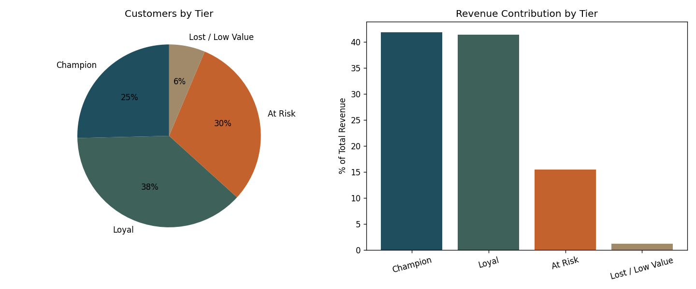

# Customer Segmentation Analysis — SQL

RFM (Recency, Frequency, Monetary) segmentation of 599 customers and 4,200 orders using SQL window functions, run against a SQLite database.

## What this project does

- Builds a two-table relational schema (`customers`, `orders`) from order-level retail data
- Calculates each customer's **Recency** (days since last order), **Frequency** (order count), and **Monetary** value (total spend) using CTEs and `NTILE()` window functions
- Scores and tiers every customer into **Champion / Loyal / At Risk / Lost** segments
- Quantifies how much revenue each tier represents — the number that actually matters for a retention strategy
- Flags high-value customers who are going quiet, as a target list for a retention campaign

## Key findings

| Tier | % of Customers | % of Revenue | Avg Spend/Customer |
|---|---|---|---|
| Champion | 25.4% | 41.8% | ₹5,41,374 |
| Loyal | 37.9% | 41.4% | ₹3,59,540 |
| At Risk | 30.4% | 15.5% | ₹1,68,055 |
| Lost / Low Value | 6.3% | 1.2% | ₹64,094 |

**Takeaway:** the top two tiers (63% of customers) drive 83% of revenue. Meanwhile, 30% of customers are "At Risk" — they've bought before but haven't recently — representing 15.5% of revenue that's actively at risk of churning. The `queries.sql` file includes a query that pulls the specific high-value customers in this at-risk bucket, which is the actual retention target list a marketing team would use.

Consumer segment customers in the South region are the single largest customer/region combination by revenue.



## Structure

```
customer-segmentation-sql/
├── queries.sql                  # all queries, commented, building up to RFM tiering
├── customer_segmentation.db     # SQLite database (customers + orders tables)
├── segment_summary.csv          # output of the tiering query
├── assets/                      # chart images
└── README.md
```

## Tools

SQL (SQLite) — CTEs, window functions (`NTILE`), conditional aggregation

## Run it yourself

```bash
sqlite3 customer_segmentation.db
.read queries.sql
```

Or open `customer_segmentation.db` in any SQLite browser (e.g. DB Browser for SQLite) and run `queries.sql` section by section.
